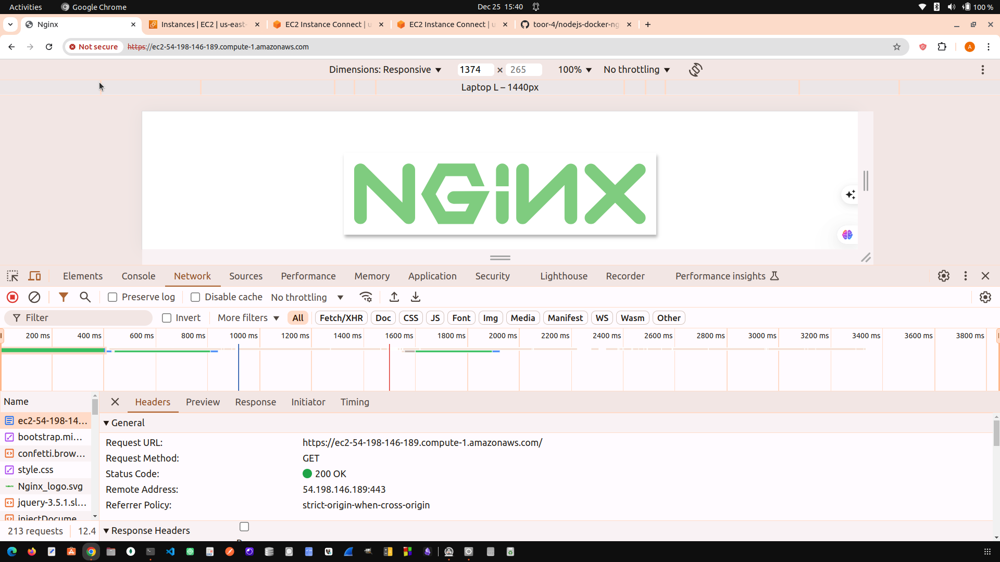

### Node.js Docker Nginx AWS

This project demonstrates how to set up a Node.js server with Nginx using Docker and Docker Compose,
and how to deploy it on AWS EC2.

#### Prerequisites

- Docker
- Docker Compose
- Node.js
- AWS account

#### Steps to Set Up Locally

1. **Clone the Repository**

   ```sh
   git clone <repository-url>
   cd nodejs-docker-nginx-aws
   ```

2. **Set Up Dependencies and Test the Application**

   ```sh
   npm install
   npm start
   ```

   Visit `http://localhost:3000`

3. **Build and Run the Docker Container**

   ```sh
   docker build -t nginx-nodejs-app .
   docker run -p 3000:3000 --name nodejs nginx-nodejs-app
   docker rm -f nodejs
   ```

4. **Using Docker Compose**
   Create a `docker-compose.yml` file and run:

   ```sh
   docker compose up --build
   ```

   Visit the following URLs to access the application instances running on different ports:

   - `http://localhost:1111` for the first instance
   - `http://localhost:2222` for the second instance
   - `http://localhost:3333` for the third instance

   ```sh
   docker compose down
   ```

#### Project Structure

```
nodejs-docker-nginx-aws/
├── public/
│   ├── images/
│   ├── style.css
│   └── index.html
├── Dockerfile
├── docker-compose.yml
├── package.json
├── package-lock.json
└── server.js
```

#### Deploying on AWS EC2

1.  **Launch an EC2 Instance**

    - Choose an Amazon Machine Image (AMI), such as Amazon Linux 2.
    - Configure instance details and security groups.

2.  **Connect to Your EC2 Instance**

    ```sh
    ssh -i /path/to/your-key-pair.pem ec2-user@your-ec2-public-dns
    ```

3.  **Install Docker and Docker Compose**

    ```sh
    sudo yum update -y
    sudo yum install docker
    sudo service docker start
    sudo usermod -a -G docker ec2-user
    sudo curl -L "https://github.com/docker/compose/releases/latest/download/docker-compose-$(uname -s)-$(uname -m)" -o /usr/local/bin/docker-compose
    sudo chmod +x /usr/local/bin/docker-compose
    ```

4.  **install git**

    ```sh
    sudo yum install git
    ```

5.  **Generate an SSH Key Pair**

    ```sh
    ssh-keygen -t rsa -b 4096
    ```

6.  **Clone Your Repository and Set Up the Application**

    ```sh
    git clone <repository-url>
    cd nodejs-docker-nginx-aws
    docker-compose up --build -d
    ```

7.  **Access Your Application**
    Visit the public DNS of your EC2 instance.

#### Setting Up Nginx

1. **Install Nginx**

   ```sh
   sudo yum update -y
   sudo yum install nginx
   sudo service nginx start
   ```

2. **Configure Nginx**

   ```
   Create a new nginx configuration file and add the necessary content. Copy `nginx.conf`'s content to `/etc/nginx/nginx.conf`:
   ```

3. **Create a folder for Nginx certificates**

   This folder will store the self-signed SSL certificates that Nginx will use to secure the connections.

   ```sh
   mkdir ~/nginx-certs
   cd ~/nginx-certs
   ```

4. **Create self-signed certificate**

   ```
   openssl req -x509 -nodes -days 365 -newkey rsa:2048 -keyout nginx-selfsigned.key -out nginx-selfsigned.crt
   ```

5. **Restart Nginx**

   ```sh
   sudo nginx -t
   sudo nginx -s reload
   ```

6. **Run docker compose**

   ```sh
   docker-compose up
   ```

7. **Verify Node.js Application**

   Ensure your Node.js application is running on the specified ports (1111, 2222, 3333):

   ```sh
   curl http://localhost:1111
   curl http://localhost:2222
   curl http://localhost:3333
   ```

   You should see the expected output from your application for each port.

8. **Verify Load Balancing**
   1. Find your EC2 instance's public DNS in the AWS Console
   2. Open the DNS address in your web browser (e.g., http://ec2-XX-XX-XX-XX.compute-1.amazonaws.com)
   3. Refresh the page multiple times to verify requests are being distributed across instances
   4. You should see responses from different server instances, indicating successful load balancing.

#### AWS


